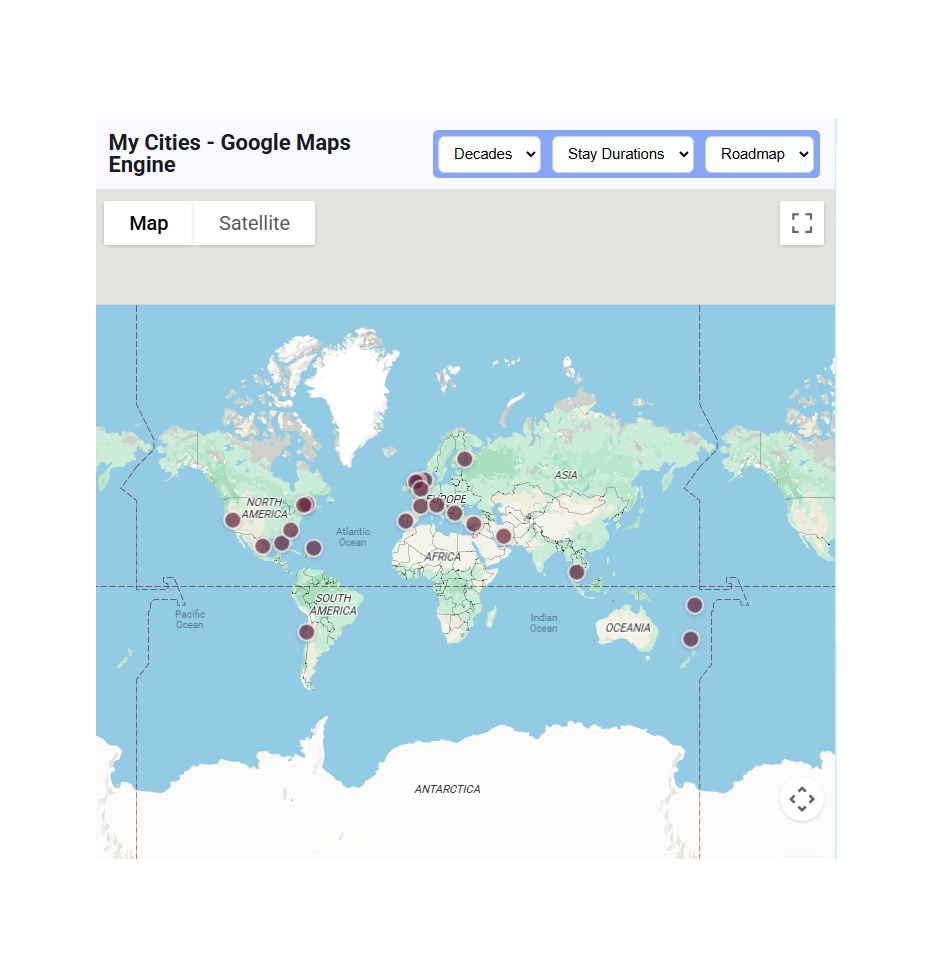
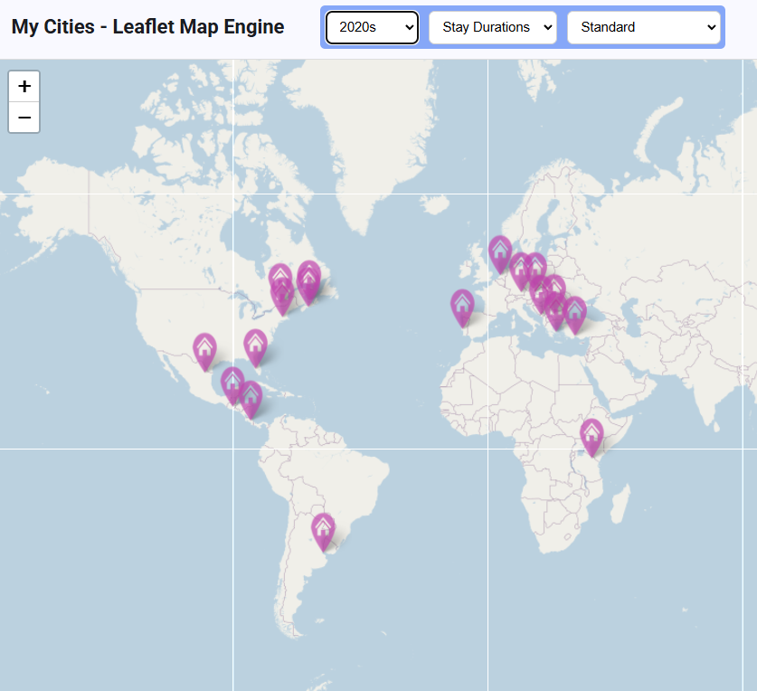
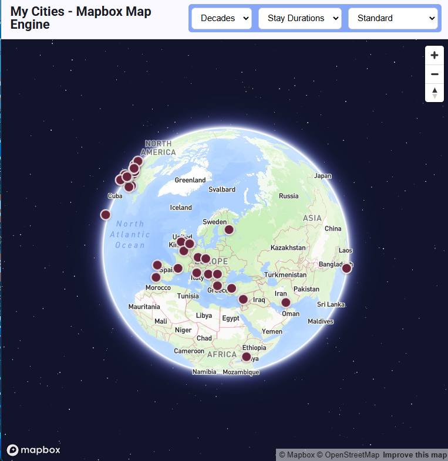
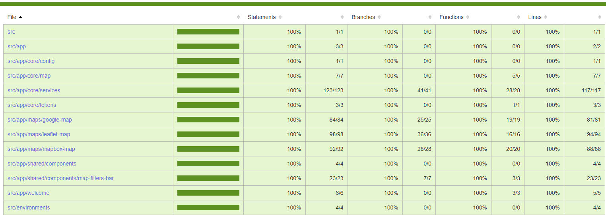

# MyCities

MyCities is a full-stack geographic visualization application that displays cities in which I have lived around the world.

The application combines an Angular frontend with a C# ASP.NET Core WebApi backend to provide interactive filtering and map-based exploration.

## Purpose

This project was built to demonstrate modern full-stack engineering practices including API design, data access patterns, and client-side visualization.

## Screenshots

### Google Maps engine

### Leaflet engine

### Mapbox engine

## Tech Stack

- Angular 19
- C# ASP.NET Core WebApi
- SQL Server (future implementation)
- Leaflet
- Mapbox
- Google Maps
- RESTful architecture

## Features

- Interactive world map with three mapping engines, each with multiple map surfaces
- Filter cities by decade lived
- Filter cities by stay duration
- Clean layered backend architecture

## Design Decisions

- Multiple map engines were implemented to evaluate tradeoffs between ecosystem maturity, customization, and performance.
- The dataset is intentionally small (~60 cities), allowing the architecture to prioritize clarity and maintainability over premature optimization.
- Standalone Angular components were used to align with modern Angular direction.

### Unit Test Code Coverage (100%)

